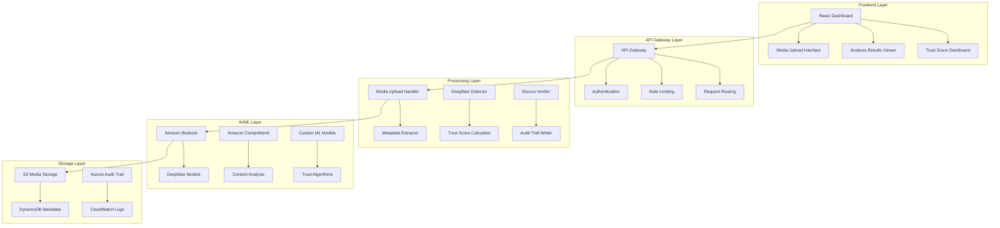

# Design Document

## Overview

Hlekkr is a high-trust audit platform that transforms GRACE's proven immutable audit trail architecture into a specialized system for deepfake detection and media verification. The design maintains the core strengths of GRACE while introducing advanced AI-powered analysis capabilities, real-time monitoring, and comprehensive trust scoring mechanisms.

## Architecture

### High-Level Architecture



### Core Components

#### 1. Media Processing Pipeline
- **S3 Media Bucket**: Enhanced with lifecycle policies, CORS configuration, and event triggers
- **Metadata Extractor**: Lambda function to extract technical metadata from uploaded media
- **Content Analyzer**: Integration with Amazon Bedrock for deepfake detection
- **Trust Score Engine**: Composite scoring algorithm combining multiple analysis factors

#### 2. Immutable Audit Trail
- **Aurora PostgreSQL**: Maintains the proven immutable ledger from GRACE
- **Blockchain Integration**: Optional integration for additional verification
- **Event Sourcing**: All state changes recorded as immutable events
- **Cryptographic Hashing**: SHA-256 hashing for content integrity

#### 3. AI-Powered Analysis
- **Amazon Bedrock Integration**: Primary deepfake detection using foundation models
- **Custom ML Pipeline**: Specialized models for media-specific analysis
- **Real-time Processing**: Stream processing for immediate threat detection
- **Model Versioning**: Tracking and rollback capabilities for ML models

## Components and Interfaces

### Frontend Components

#### Media Upload Interface
```typescript
interface MediaUploadProps {
  onUploadComplete: (mediaId: string) => void;
  acceptedFormats: string[];
  maxFileSize: number;
  enableBatchUpload: boolean;
}

interface MediaMetadata {
  id: string;
  filename: string;
  fileType: string;
  fileSize: number;
  uploadTimestamp: Date;
  checksum: string;
}
```

#### Analysis Results Viewer
```typescript
interface AnalysisResult {
  mediaId: string;
  deepfakeConfidence: number;
  trustScore: number;
  detectedManipulations: string[];
  analysisTimestamp: Date;
  processingTime: number;
}

interface TrustScoreBreakdown {
  deepfakeScore: number;
  sourceReliability: number;
  metadataConsistency: number;
  historicalPattern: number;
  compositeScore: number;
}
```

### Backend Interfaces

#### Media Processing API
```python
class MediaProcessor:
    def upload_media(self, file_data: bytes, metadata: dict) -> str
    def extract_metadata(self, media_id: str) -> dict
    def analyze_deepfake(self, media_id: str) -> AnalysisResult
    def calculate_trust_score(self, media_id: str) -> TrustScore
    def verify_source(self, media_id: str) -> SourceVerification
```

#### Audit Trail Interface
```python
class AuditTrail:
    def record_event(self, event: AuditEvent) -> str
    def verify_integrity(self, event_id: str) -> bool
    def query_history(self, media_id: str) -> List[AuditEvent]
    def generate_proof(self, event_id: str) -> CryptographicProof
```

### AWS Service Integration

#### Lambda Functions
1. **Media Upload Handler**: Processes file uploads and triggers analysis
2. **Metadata Extractor**: Extracts technical metadata from media files
3. **Deepfake Detector**: Interfaces with Amazon Bedrock for AI analysis
4. **Trust Score Calculator**: Computes composite trust scores
5. **Source Verifier**: Validates media provenance and source reliability
6. **Audit Handler**: Maintains immutable audit trail records

#### API Gateway Configuration
```yaml
Resources:
  MediaAPI:
    Type: AWS::ApiGateway::RestApi
    Properties:
      Name: HlekkrMediaAPI
      EndpointConfiguration:
        Types: [REGIONAL]
      
  MediaResource:
    Type: AWS::ApiGateway::Resource
    Properties:
      RestApiId: !Ref MediaAPI
      ParentId: !GetAtt MediaAPI.RootResourceId
      PathPart: media
      
  UploadMethod:
    Type: AWS::ApiGateway::Method
    Properties:
      RestApiId: !Ref MediaAPI
      ResourceId: !Ref MediaResource
      HttpMethod: POST
      AuthorizationType: AWS_IAM
```

## Data Models

### Media Record
```typescript
interface MediaRecord {
  id: string;
  filename: string;
  contentType: string;
  fileSize: number;
  checksum: string;
  uploadTimestamp: Date;
  userId: string;
  s3Location: {
    bucket: string;
    key: string;
  };
  metadata: {
    technical: TechnicalMetadata;
    extracted: ExtractedMetadata;
    analysis: AnalysisMetadata;
  };
  status: 'uploaded' | 'processing' | 'analyzed' | 'failed';
}
```

### Analysis Result
```typescript
interface AnalysisResult {
  mediaId: string;
  analysisId: string;
  timestamp: Date;
  deepfakeDetection: {
    confidence: number; // 0-100
    detectedTechniques: string[];
    modelVersion: string;
    processingTime: number;
  };
  trustScore: {
    composite: number; // 0-100
    breakdown: TrustScoreBreakdown;
    factors: TrustFactor[];
  };
  sourceVerification: {
    originalSource: string;
    verificationStatus: 'verified' | 'unverified' | 'suspicious';
    chainOfCustody: CustodyRecord[];
  };
}
```

### Audit Event
```typescript
interface AuditEvent {
  id: string;
  mediaId: string;
  eventType: 'upload' | 'analysis' | 'score_update' | 'access';
  timestamp: Date;
  userId: string;
  data: any;
  previousHash: string;
  currentHash: string;
  signature: string;
}
```

## Error Handling

### Error Categories
1. **Upload Errors**: File format, size, or corruption issues
2. **Processing Errors**: AI model failures or timeout issues
3. **Storage Errors**: S3 or database connectivity problems
4. **Authentication Errors**: Invalid credentials or expired tokens
5. **Rate Limiting**: API quota exceeded or suspicious activity

### Error Response Format
```typescript
interface ErrorResponse {
  error: {
    code: string;
    message: string;
    details?: any;
    timestamp: Date;
    requestId: string;
  };
  retry?: {
    after: number; // seconds
    maxAttempts: number;
  };
}
```

### Retry Mechanisms
- **Exponential Backoff**: For transient failures
- **Circuit Breaker**: For downstream service failures
- **Dead Letter Queue**: For persistent processing failures
- **Manual Intervention**: For critical analysis failures

## Testing Strategy

### Unit Testing
- **Lambda Functions**: Individual function testing with mocked dependencies
- **Data Models**: Validation and serialization testing
- **Utility Functions**: Edge case and error condition testing
- **API Endpoints**: Request/response validation testing

### Integration Testing
- **End-to-End Workflows**: Complete media processing pipeline testing
- **AWS Service Integration**: S3, DynamoDB, and Bedrock integration testing
- **Authentication Flow**: Cognito integration and permission testing
- **Error Scenarios**: Failure mode and recovery testing

### Performance Testing
- **Load Testing**: Concurrent user and file upload testing
- **Stress Testing**: System behavior under extreme load
- **Scalability Testing**: Auto-scaling and resource optimization
- **Latency Testing**: Response time optimization and monitoring

### Security Testing
- **Authentication Testing**: Access control and token validation
- **Authorization Testing**: Role-based permission enforcement
- **Input Validation**: Malicious file and data injection testing
- **Encryption Testing**: Data at rest and in transit protection

## Deployment Architecture

### Multi-Environment Strategy
- **Development**: Single-region deployment with reduced resources
- **Staging**: Production-like environment for final testing
- **Production**: Multi-AZ deployment with full redundancy and monitoring

### Infrastructure as Code
- **AWS CDK**: TypeScript-based infrastructure definitions
- **Stack Organization**: Modular stacks for different components
- **Environment Configuration**: Parameter-based environment management
- **Deployment Pipeline**: Automated CI/CD with testing gates

### Monitoring and Observability
- **CloudWatch Metrics**: Custom metrics for business and technical KPIs
- **Distributed Tracing**: X-Ray integration for request tracing
- **Log Aggregation**: Centralized logging with structured formats
- **Alerting**: Proactive monitoring with automated response capabilities