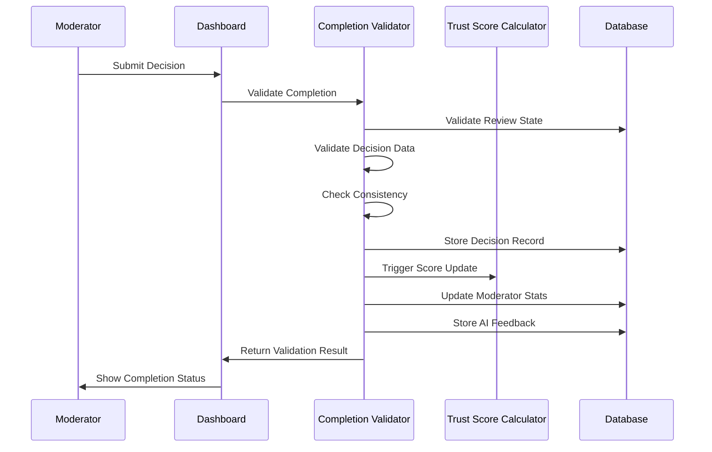
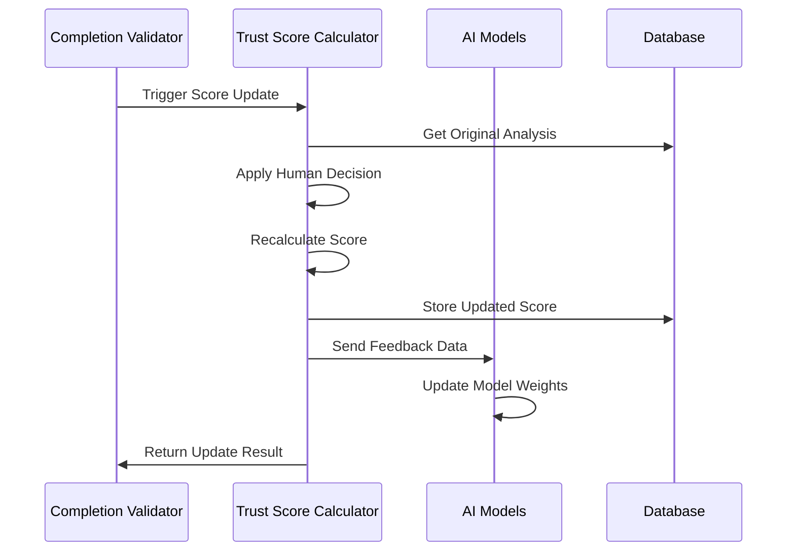

# Review Completion Validator

This Lambda function handles the validation and processing of review completions in the Hlekkr human-in-the-loop workflow. It ensures decision quality, updates trust scores, and provides feedback loops for AI model improvement.

## Features

### Decision Validation
- **Comprehensive Validation**: Validates decision data structure, required fields, and data types
- **Business Logic Checks**: Ensures decisions are logically consistent and complete
- **Consistency Analysis**: Compares human decisions against AI predictions for quality assurance
- **Error Prevention**: Prevents invalid or incomplete decisions from being processed

### Trust Score Integration
- **Automatic Updates**: Triggers trust score recalculation based on human decisions
- **Score Adjustment**: Applies human-validated trust score adjustments
- **Confidence Weighting**: Incorporates human confidence levels into final scores
- **Audit Trail**: Maintains complete history of score changes and justifications

### AI Feedback Loop
- **Model Improvement**: Collects human decisions for AI model training
- **Pattern Recognition**: Identifies systematic AI errors for correction
- **Retraining Triggers**: Automatically triggers model retraining when thresholds are met
- **Performance Tracking**: Monitors AI accuracy improvements over time

### Quality Assurance
- **Consistency Checks**: Flags unusual decision patterns for review
- **Statistical Analysis**: Tracks moderator performance and decision quality
- **Audit Mechanisms**: Comprehensive logging and audit trail for all decisions
- **Escalation Triggers**: Automatic escalation for questionable decisions

## Supported Actions

### Primary Actions
- `validate_completion` - Validate and process review completion
- `process_decision` - Process individual decision records
- `update_trust_score` - Trigger trust score updates
- `quality_check` - Perform quality assurance checks

### Analytics Actions
- `feedback_loop` - Process AI feedback data
- `consistency_check` - Perform consistency analysis
- `get_completion_stats` - Retrieve completion statistics

## Decision Data Structure

### Required Fields
```json
{
  "decisionType": "override|confirm|escalate|inconclusive",
  "confidenceLevel": "very_low|low|medium|high|very_high",
  "justification": "Detailed explanation (10-2000 characters)"
}
```

### Optional Fields
```json
{
  "trustScoreAdjustment": 75.0,
  "threatLevel": "none|low|medium|high|critical",
  "tags": ["false-positive", "authentic", "manipulation"],
  "additionalEvidence": [
    {
      "type": "technical_analysis",
      "description": "Metadata inconsistencies found",
      "confidence": 0.8
    }
  ],
  "reviewNotes": "Additional observations and context",
  "escalationReason": "Complex case requiring senior review"
}
```

## Validation Rules

### Decision Type Validation
- **Confirm**: AI decision is correct, minimal score adjustment allowed
- **Override**: AI decision is incorrect, significant score adjustment expected
- **Escalate**: Case is too complex, requires senior moderator review
- **Inconclusive**: Insufficient evidence to make definitive decision

### Consistency Checks
- **Large Score Differences**: Flags adjustments >30 points from AI score
- **Override Validation**: Ensures overrides have significant score changes (>15 points)
- **Confirm Validation**: Warns if confirmed decisions have large adjustments (>10 points)
- **Confidence Mismatches**: Flags low-confidence overrides of high-confidence AI decisions

### Data Validation
- **Justification Length**: 10-2000 characters required
- **Trust Score Range**: 0-100 if provided
- **Tag Limits**: Maximum 10 tags (warning at >10)
- **Evidence Structure**: Validates additional evidence format

## Environment Variables

| Variable | Description | Example |
|----------|-------------|---------|
| `REVIEW_QUEUE_TABLE_NAME` | DynamoDB table for reviews | `hlekkr-review-queue-123-us-east-1` |
| `MODERATOR_PROFILE_TABLE_NAME` | DynamoDB table for moderators | `hlekkr-moderator-profile-123-us-east-1` |
| `REVIEW_DECISION_TABLE_NAME` | DynamoDB table for decisions | `hlekkr-review-decision-123-us-east-1` |
| `AUDIT_TABLE_NAME` | DynamoDB table for audit trail | `hlekkr-audit-123-us-east-1` |
| `TRUST_SCORE_CALCULATOR_FUNCTION_NAME` | Trust score calculator Lambda | `hlekkr-trust-score-calculator-123-us-east-1` |
| `MODERATOR_ALERTS_TOPIC_ARN` | SNS topic for notifications | `arn:aws:sns:us-east-1:123:moderator-alerts` |

## API Examples

### Validate Review Completion
```python
import boto3

lambda_client = boto3.client('lambda')

response = lambda_client.invoke(
    FunctionName='hlekkr-review-completion-validator',
    Payload=json.dumps({
        'action': 'validate_completion',
        'reviewId': 'review-123',
        'moderatorId': 'mod-456',
        'decisionData': {
            'decisionType': 'override',
            'confidenceLevel': 'high',
            'justification': 'After detailed analysis, this appears to be authentic content.',
            'trustScoreAdjustment': 80.0,
            'threatLevel': 'none',
            'tags': ['false-positive', 'authentic']
        }
    })
)
```

### Process AI Feedback
```python
response = lambda_client.invoke(
    FunctionName='hlekkr-review-completion-validator',
    Payload=json.dumps({
        'action': 'feedback_loop',
        'reviewId': 'review-123',
        'feedbackType': 'correction'
    })
)
```

## Workflow Integration

### Review Completion Flow


### Trust Score Update Flow


## Quality Assurance Features

### Consistency Monitoring
- **Score Deviation Analysis**: Tracks patterns in human-AI disagreements
- **Decision Pattern Recognition**: Identifies unusual decision patterns
- **Moderator Calibration**: Ensures consistent decision-making across moderators
- **Bias Detection**: Monitors for systematic biases in human decisions

### Performance Metrics
- **Completion Rate**: Percentage of reviews completed within SLA
- **Decision Quality**: Consistency and accuracy of human decisions
- **Processing Time**: Average time from assignment to completion
- **Escalation Rate**: Percentage of reviews requiring escalation

### Audit Trail
- **Complete History**: Every decision and validation step recorded
- **Immutable Records**: Tamper-proof audit trail with cryptographic integrity
- **Searchable Logs**: Efficient querying of historical decisions
- **Compliance Ready**: Meets regulatory requirements for decision auditing

## Error Handling

### Validation Errors
- Missing required fields in decision data
- Invalid enumeration values
- Out-of-range numerical values
- Malformed data structures

### Business Logic Errors
- Review not in valid state for completion
- Moderator not assigned to review
- Consistency check failures
- Trust score calculation errors

### System Errors
- Database connectivity issues
- Lambda invocation failures
- SNS notification failures
- Bedrock API errors

## Monitoring & Alerting

### CloudWatch Metrics
```python
# Custom metrics for completion validation
cloudwatch.put_metric_data(
    Namespace='Hlekkr/ReviewCompletion',
    MetricData=[
        {
            'MetricName': 'CompletionValidationSuccess',
            'Value': 1,
            'Unit': 'Count',
            'Dimensions': [
                {'Name': 'DecisionType', 'Value': decision_type},
                {'Name': 'ModeratorRole', 'Value': moderator_role}
            ]
        }
    ]
)
```

### Alerting Thresholds
- **High Inconsistency Rate**: >20% of decisions flagged for consistency issues
- **Low Completion Rate**: <80% of assigned reviews completed within SLA
- **Validation Failures**: >5% of completion attempts fail validation
- **Trust Score Errors**: Any failures in trust score update process

## Testing

### Unit Tests
```bash
python -m pytest test_completion_validator.py -v
```

### Validation Script
```bash
python validate_completion_validator.py
```

### Integration Testing
```bash
# Test complete review workflow
aws lambda invoke --function-name hlekkr-review-completion-validator \
  --payload file://test-completion-event.json response.json

# Test decision validation
aws lambda invoke --function-name hlekkr-review-completion-validator \
  --payload '{"action":"validate_completion","reviewId":"test-123"}' \
  response.json
```

## Performance Considerations

### Optimization Strategies
- **Batch Processing**: Process multiple completions in single invocation
- **Connection Pooling**: Reuse database connections
- **Async Operations**: Use EventBridge for non-critical operations
- **Caching**: Cache moderator profiles and review metadata

### Scalability Features
- **Auto-scaling**: Lambda concurrency scales with completion volume
- **DynamoDB Streams**: Real-time processing of completion events
- **SNS Fan-out**: Parallel notification delivery
- **Bedrock Integration**: Scalable AI feedback processing

## Security Considerations

### Data Protection
- **Encryption**: All data encrypted at rest and in transit
- **Access Control**: IAM-based access to all resources
- **Audit Logging**: Complete audit trail for compliance
- **PII Handling**: Secure handling of moderator and decision data

### Validation Security
- **Input Sanitization**: All inputs validated and sanitized
- **SQL Injection Prevention**: Parameterized queries only
- **Authorization Checks**: Verify moderator assignment before processing
- **Rate Limiting**: Prevent abuse through Lambda concurrency limits

This component completes the critical gap in our HITL workflow, ensuring that human decisions are properly validated, processed, and integrated back into the trust scoring system while maintaining comprehensive quality assurance and audit capabilities.