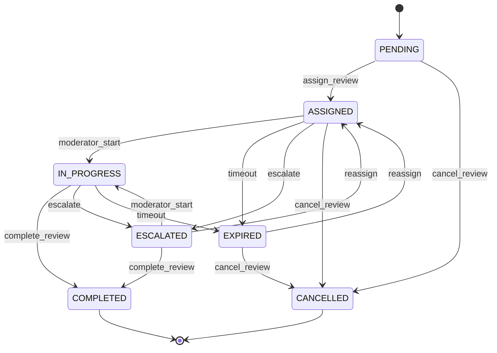

# Review Lifecycle Manager

This Lambda function manages the complete lifecycle of review assignments in the Hlekkr human-in-the-loop workflow, including automated state transitions, timeout detection, escalations, and reassignments.

## Features

### Automated Review Management
- **Review Assignment**: Intelligent assignment of reviews to available moderators
- **Timeout Detection**: Automatic detection and handling of timed-out reviews
- **Escalation Management**: Automatic escalation of complex or overdue reviews
- **Reassignment Logic**: Smart reassignment when moderators become unavailable

### Lifecycle State Management
- **Status Transitions**: Automated state transitions with validation
- **Workload Balancing**: Role-based capacity management and load distribution
- **Priority Handling**: Priority-based timeout and escalation rules
- **Audit Trail**: Complete tracking of all lifecycle events

### Scheduled Operations
- **Periodic Cleanup**: Automated cleanup of expired and cancelled reviews
- **Health Monitoring**: Continuous monitoring of review queue health
- **Performance Optimization**: Automatic optimization of assignment algorithms
- **Escalation Triggers**: Proactive escalation based on configurable rules

## Event Types

### Direct Lambda Invocations
```json
{
  "action": "assign_review",
  "reviewId": "review-123",
  "moderatorId": "mod-456"
}
```

### EventBridge Scheduled Events
```json
{
  "source": "aws.events",
  "detail-type": "Review Timeout Check",
  "detail": {
    "operation": "timeout-check"
  }
}
```

### DynamoDB Stream Events
```json
{
  "Records": [
    {
      "eventSource": "aws:dynamodb",
      "eventName": "MODIFY",
      "dynamodb": {
        "Keys": {"reviewId": {"S": "review-123"}},
        "NewImage": {...}
      }
    }
  ]
}
```

## Supported Actions

### Review Assignment
- `assign_review` - Assign review to specific moderator
- `reassign_review` - Reassign review to different moderator
- `escalate_review` - Escalate review to senior moderator

### Status Management
- `update_review_status` - Update review status with validation
- `complete_review` - Mark review as completed with decision data
- `cancel_review` - Cancel review with reason

### Information Retrieval
- `get_review_status` - Get current review status and metadata
- `get_moderator_workload` - Get current moderator workload and capacity

## Review Status Flow



## Priority-Based Configuration

### Timeout Rules
| Priority | Assignment Timeout | Max Duration | Escalation |
|----------|-------------------|--------------|------------|
| Critical | 2 hours | 1 hour | Immediate to Lead |
| High | 4 hours | 2 hours | After 1 reassignment |
| Normal | 8 hours | 4 hours | After 2 reassignments |
| Low | 24 hours | 8 hours | Manual only |

### Role-Based Capacity
| Role | Max Concurrent | Can Handle Critical | Escalation Target |
|------|----------------|-------------------|------------------|
| Junior | 3 reviews | No | Senior/Lead |
| Senior | 5 reviews | Yes | Lead |
| Lead | 7 reviews | Yes | Manual review |

## Environment Variables

| Variable | Description | Example |
|----------|-------------|---------|
| `REVIEW_QUEUE_TABLE_NAME` | DynamoDB table for reviews | `hlekkr-review-queue-123-us-east-1` |
| `MODERATOR_PROFILE_TABLE_NAME` | DynamoDB table for moderators | `hlekkr-moderator-profile-123-us-east-1` |
| `REVIEW_DECISION_TABLE_NAME` | DynamoDB table for decisions | `hlekkr-review-decision-123-us-east-1` |
| `MODERATOR_ALERTS_TOPIC_ARN` | SNS topic for notifications | `arn:aws:sns:us-east-1:123:moderator-alerts` |

## Assignment Algorithm

### Moderator Scoring (0-100 points)
```python
score = (
    accuracy_score * 40 +           # 0-40 points
    experience_bonus * 20 +         # 0-20 points  
    role_bonus +                    # 5-15 points
    specialization_match * 15 +     # 0-15 points
    activity_bonus * 10 -           # 0-10 points
    workload_penalty * 10           # 0-10 penalty
)
```

### Selection Criteria
1. **Availability Check**: Active status, within capacity, can handle priority
2. **Score Calculation**: Multi-factor scoring algorithm
3. **Best Match Selection**: Highest scoring available moderator
4. **Fallback Logic**: Escalation if no suitable moderator found

## Scheduled Operations

### Timeout Checking (Every 5 minutes)
```json
{
  "source": "aws.events",
  "detail-type": "Review Timeout Check"
}
```

### Reassignment Checking (Every 15 minutes)
```json
{
  "source": "aws.events", 
  "detail-type": "Review Reassignment Check"
}
```

### Escalation Checking (Every 10 minutes)
```json
{
  "source": "aws.events",
  "detail-type": "Review Escalation Check"
}
```

### Cleanup Operations (Daily)
```json
{
  "source": "aws.events",
  "detail-type": "Review Cleanup"
}
```

## Error Handling

### Validation Errors
- Invalid review ID or moderator ID
- Invalid status transitions
- Capacity exceeded
- Priority mismatch

### Business Logic Errors
- Moderator unavailable
- Review already assigned
- Timeout calculation errors
- Escalation failures

### System Errors
- DynamoDB connectivity issues
- SNS notification failures
- EventBridge scheduling errors
- Lambda invocation failures

## Monitoring & Logging

### CloudWatch Metrics
- Review assignment success/failure rates
- Average assignment time
- Timeout and escalation rates
- Moderator utilization rates

### Custom Metrics
```python
# Assignment metrics
cloudwatch.put_metric_data(
    Namespace='Hlekkr/ReviewLifecycle',
    MetricData=[
        {
            'MetricName': 'ReviewsAssigned',
            'Value': 1,
            'Unit': 'Count',
            'Dimensions': [
                {'Name': 'Priority', 'Value': priority},
                {'Name': 'ModeratorRole', 'Value': role}
            ]
        }
    ]
)
```

### Logging Levels
- **INFO**: Normal operations, assignments, completions
- **WARN**: Timeouts, reassignments, capacity issues
- **ERROR**: System failures, invalid operations
- **DEBUG**: Detailed scoring, selection logic

## Integration Points

### Review Workflow Trigger
```python
# Trigger review assignment
lambda_client.invoke(
    FunctionName='hlekkr-review-lifecycle-manager',
    InvocationType='Event',
    Payload=json.dumps({
        'action': 'assign_review',
        'reviewId': review_id,
        'moderatorId': selected_moderator_id
    })
)
```

### Moderator Dashboard
```python
# Get moderator workload
response = lambda_client.invoke(
    FunctionName='hlekkr-review-lifecycle-manager',
    Payload=json.dumps({
        'action': 'get_moderator_workload',
        'moderatorId': moderator_id
    })
)
```

### EventBridge Scheduling
```python
# Schedule timeout check
eventbridge.put_rule(
    Name=f'review-timeout-{review_id}',
    ScheduleExpression=f'at({timeout_time})',
    State='ENABLED'
)
```

## Testing

### Unit Tests
```bash
python -m pytest test_lifecycle_manager.py -v
```

### Validation Script
```bash
python validate_lifecycle_manager.py
```

### Integration Testing
```bash
# Test assignment flow
aws lambda invoke --function-name hlekkr-review-lifecycle-manager \
  --payload '{"action":"assign_review","reviewId":"test-123","moderatorId":"mod-456"}' \
  response.json

# Test timeout checking
aws lambda invoke --function-name hlekkr-review-lifecycle-manager \
  --payload '{"source":"aws.events","detail-type":"Review Timeout Check"}' \
  response.json
```

## Performance Considerations

### Optimization Strategies
- **Connection Pooling**: Reuse DynamoDB connections
- **Batch Operations**: Process multiple reviews in single invocation
- **Caching**: Cache moderator profiles for assignment decisions
- **Async Processing**: Use EventBridge for non-critical operations

### Scalability Features
- **Auto-scaling**: Lambda concurrency scales with demand
- **DynamoDB On-Demand**: Automatic capacity scaling
- **SNS Fan-out**: Parallel notification delivery
- **EventBridge Rules**: Distributed scheduling

## Troubleshooting

### Common Issues

1. **Assignment Failures**
   - Check moderator availability and capacity
   - Verify priority and role compatibility
   - Review workload distribution

2. **Timeout Issues**
   - Validate timeout calculations
   - Check EventBridge rule configuration
   - Verify Lambda permissions

3. **Escalation Problems**
   - Ensure senior moderators are available
   - Check escalation trigger logic
   - Verify role-based permissions

### Debug Commands
```bash
# Check review status
aws dynamodb get-item --table-name hlekkr-review-queue \
  --key '{"reviewId":{"S":"review-123"}}'

# Check moderator workload
aws dynamodb query --table-name hlekkr-review-queue \
  --index-name ModeratorIndex \
  --key-condition-expression "assignedModerator = :mod" \
  --expression-attribute-values '{":mod":{"S":"mod-123"}}'

# Check Lambda logs
aws logs tail /aws/lambda/hlekkr-review-lifecycle-manager --follow
```

## Security Considerations

### IAM Permissions
- Least privilege access to DynamoDB tables
- SNS publish permissions for notifications
- EventBridge rule management permissions
- Lambda invoke permissions for cross-function calls

### Data Protection
- Encryption at rest for all DynamoDB tables
- Encryption in transit for all API calls
- Audit logging for all lifecycle events
- PII anonymization in logs

### Access Control
- Role-based assignment restrictions
- Priority-based access controls
- Moderator capacity enforcement
- Review isolation and access controls